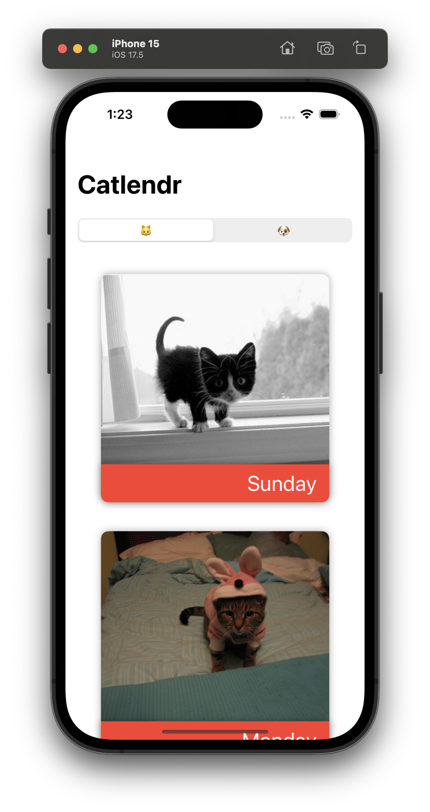
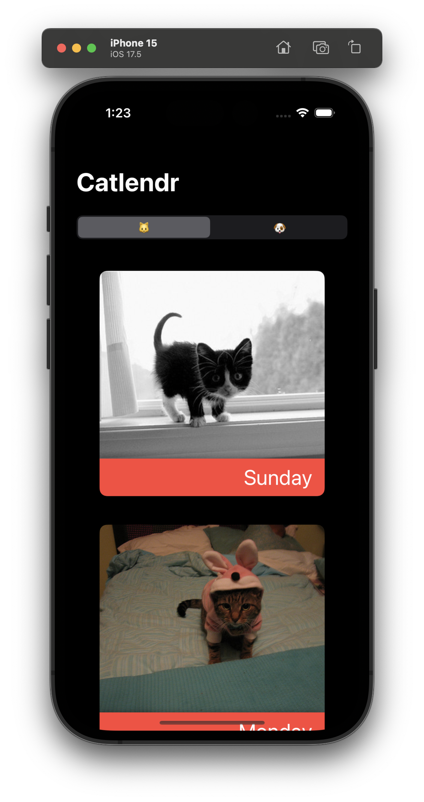

# Catlendr 🐱📅

Catlendr is a modern iOS app that displays a seven-day calendar with pictures of cute animals sourced from [thecatapi.com](https://thecatapi.com) or [thedogapi.com](https://thedogapi.com). Each day of the current week is represented with an adorable animal image, bringing a bit of joy to your daily schedule.

## Features

- **7-Day Calendar:** Displays the current calendar week, with each day featuring a cute animal picture.
- **API Integration:** Animal pictures are fetched dynamically from thecatapi.com or thedogapi.com using their public API.
- **Custom UI:** The calendar cells feature the animal image as the background, with the date layered on top.
- **Current Day Highlight:** The current day is visually highlighted to stand out.
- **Responsive Design:** The app is optimized for performance, even on slower networks, with images loading asynchronously.

## Screenshots




## Getting Started

### Prerequisites

- **Xcode:** Ensure you have the latest stable version of Xcode installed.
- **Swift:** The project is written in Swift, utilizing SwiftUI and/or UIKit.

### Installation

1. Clone the repository:

   ```bash
   git clone https://github.com/ObjectivelyJames/Catlendr.git
